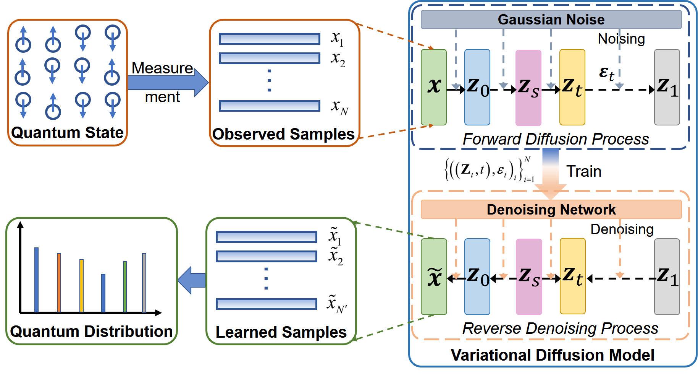

# **Learning Quantum Distributions with Variational Diffusion Models**

The official PyTorch implementation of the paper named `Learning Quantum Distributions with Variational Diffusion Models`, has been accepted in IFAC World Congress 2023 (The 22nd World Congress of the International Federation of Automatic Control).



### **Abstract**

It is challenging to identify the state of many-body quantum systems, as recovering density matrices underlying the quantum state typically requires computational resources scale exponentially to the system size. In this work, we introduce the variational diffusion model (VDM) to efficiently learn high-dimensional quantum distributions with high fidelity, which is essential to realize the ultrafast reconstruction of quantum states. We build up the VDMs suitable for dealing with the high-dimensional quantum samples, and then run numerical experiments to test our model and other autoregressive models, including recurrent neural network and transformer. It is found that the VDM can achieve a modest better performance than other two to learn the distribution as desired. Our results pave the way to applying diffusion models to solve hard problems in the quantum domain.

## Getting started

This code was tested on the computer with a single AMD Ryzen 5 2600X CPU @ 3.60GHz with 16GB RAM and a single NVIDIA GeForce RTX 1070 Ti GPU with 8GB RAM, and requires:

- Python 3.7
- conda3
- einops==0.6.0
- matplotlib==3.5.2
- numpy==1.23.4
- openpyxl==3.0.10
- scikit_learn==1.2.2
- scipy==1.9.1
- tensorflow==2.12.0
- tensorflow_gpu==2.6.0
- torch==1.12.0+cu116
- tqdm==4.64.1

You can install code environments by:

```bash
pip install -r requirements.txt
```

## Observed Quantum Samples

```bash
cd "datasets"

# ---Section 4.2 experiment
# GHZ state
python data_generation.py --n_ex 1 --state GHZ_P
# W state
python data_generation.py --n_ex 1 --state W_P

# ---Section 4.3 experiment
# GHZ state
python data_generation.py --n_ex 2 --state GHZ_P
# W state
python data_generation.py --n_ex 2 --state W_P
```

Training samples are saved in [`datasets/data`](datasets/data).
If memory error is reported, please set virtual memory.

## Learning the Underlying Quantum Distribution

### Section 4.2 Learning Fixed Quantum Distributions with Multiple Generative Samples

```bash
# ---RNN model
# GHZ state
python main.py --n_ex 1 --state GHZ_P --model RNN
# W state
python main.py --n_ex 1 --state W_P --model RNN

# ---Transformer model
# GHZ state
python main.py --n_ex 1 --state GHZ_P --model AQT
# W state
python main.py --n_ex 1 --state W_P --model AQT

# ---Variational diffusion model (Ours)
# GHZ state
python main.py --n_ex 1 --state GHZ_P --model VDM
# W state
python main.py --n_ex 1 --state W_P --model VDM
```

The samples learned from three models are saved in [`results/sample_P`](results/sample_P).

### Section 4.3 Learning Multiple Quantum Distributions with Fixed Generative Samples

```bash
# ---RNN model
# GHZ state
python main.py --n_ex 2 --state GHZ_P --model RNN
# W state
python main.py --n_ex 2 --state W_P --model RNN

# ---Transformer model
# GHZ state
python main.py --n_ex 2 --state GHZ_P --model AQT
# W state
python main.py --n_ex 2 --state W_P --model AQT

# ---Variational diffusion model (Ours)
# GHZ state
python main.py --n_ex 2 --state GHZ_P --model VDM
# W state
python main.py --n_ex 2 --state W_P --model VDM
```

The samples learned from three models are saved in [`results/sample_P`](results/sample_P).

## **Acknowledgments**

This code is standing on the shoulders of giants. We want to thank the following contributors that our code is based on: [POVM_GENMODEL](https://github.com/carrasqu/POVM_GENMODEL), [AQT](https://github.com/KimGroup/AQT), [QST-NNGMs-FNN](https://github.com/foxwy/QST-NNGMs-FNN).

## **License**

This code is distributed under an [Mozilla Public License Version 2.0](LICENSE).

Note that our code depends on other libraries, including POVM_GENMODEL, qMLE, and uses algorithms that each have their own respective licenses that must also be followed.
